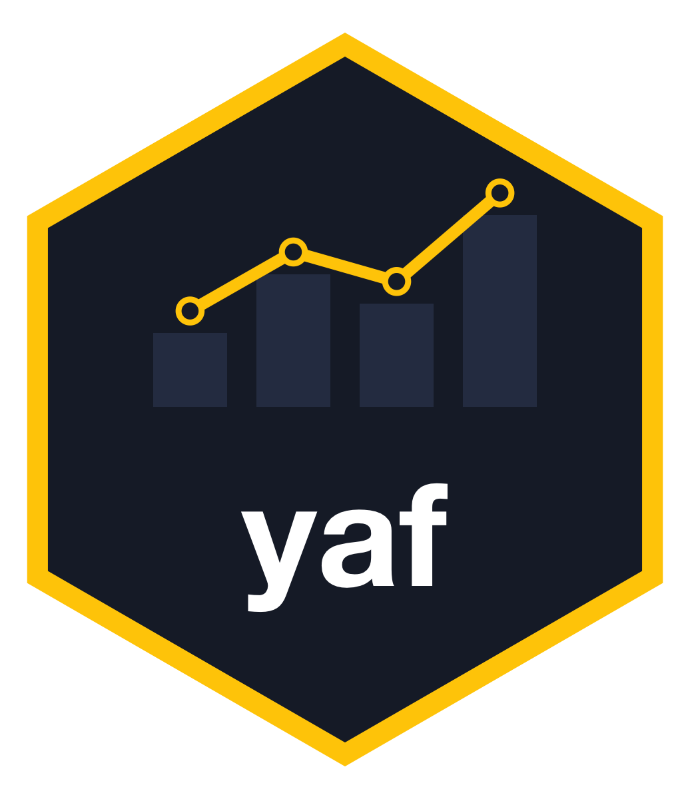

# yaf 

Пакет `yaf` (Yandex Direct API Functions) предназначен для простой и быстрой выгрузки статистики из API Яндекс.Директа напрямую в R. Пакет берет на себя все сложности с авторизацией, обработкой JSON-ответов и автоматическим преобразованием типов данных.

## Требования

Для стабильной работы пакета вам понадобятся: \* **R** версии 4.1.0 или выше (пакет использует нативный пайп `|>`). \* **RStudio** или **Positron IDE**. \* **Rtools** (только для пользователей **Windows**) — необходим для сборки пакета при установке из исходного кода.

## Установка

Установите актуальную версию пакета напрямую из GitHub репозитория:

``` r
if (!require("remotes")) install.packages("remotes")
remotes::install_github("tem19/yaf")
```

## Авторизация и безопасность

Для работы с API Яндекс Директа пакет использует официальный протокол OAuth2.

### Как это работает:

1.  При первом вызове функции `yaf_get_report("ваш_логин")` и других откроется браузер.

2.  Яндекс попросит вас разрешить доступ приложению и покажет токен в окне браузера.

3.  Скопируйте токен в браузере, вставьте в консоли Rstudio и нажмите Enter.

4.  После ввода кода в консоль R, пакет создаст файл токена с расширением `.rds`.

### Где хранится токен?

Токен сохраняется локально на вашем компьютере в специальную системную папку. Пакет автоматически определяет путь в зависимости от операционной системы:

-   macOS: `~/Library/Application Support/yaf/`

-   Windows: `C:\Users\ИмяПользователя\AppData\Local\yaf\config\`

При каждом следующем запуске пакет будет сам искать токен в этой папке. Вам не придется проходить авторизацию повторно, пока срок действия токена не истечет (обычно 1 год).

Вы можете узнать точный путь к папке с токенами на вашем ПК командой в консоли R:

`tools::R_user_dir("yaf", "config")`

## yaf_get_report() - выгрузка статистики

Данная функция предназначена для выгрузки отчетов по рекламным кампаниям. У нее только 1 обязательный параметр - логин в Директе. В таком случае будут выгружены поля `Date`, `Impressions` и `Clicks` за 7 последних дней.

Пример:

```         
library(yaf)
yaf_get_report(login = "your_yandex_login")
```

### Необязательные параметры

`date_from` - начальная дата в выгрузке в формате YYYY-MM-DD\

`date_to` - конечная дата в выгрузке в формате YYYY-MM-DD\

`date_range_type` - период отчета; если выбрано, то `date_from` и `date_to` игнорируются:   

- `TODAY` — текущий день;  

- `YESTERDAY` — вчера;  

- `LAST_3_DAYS`, `LAST_5_DAYS`, `LAST_7_DAYS`, `LAST_14_DAYS`, `LAST_30_DAYS`, `LAST_90_DAYS`, `LAST_365_DAYS` — указанное количество предыдущих дней, не включая текущий день;  

- `THIS_WEEK_MON_TODAY` — текущая неделя начиная с понедельника, включая текущий день;  

- `THIS_WEEK_SUN_TODAY` — текущая неделя начиная с воскресенья, включая текущий день;  

- `LAST_WEEK` — прошлая неделя с понедельника по воскресенье;  

- `LAST_BUSINESS_WEEK` — прошлая рабочая неделя с понедельника по пятницу;  

- `LAST_WEEK_SUN_SAT` — прошлая неделя с воскресенья по субботу;  

- `THIS_MONTH` — текущий календарный месяц;   

- `LAST_MONTH` — полный предыдущий календарный месяц;  

- `ALL_TIME` — вся доступная статистика, включая текущий день;  

`fields` - вектор с перечислением полей отчета\

`goals` - вектор с номерами целей Метрики, которые нужно выгрузить в качестве конверсий   

`attribution` - модель атрибуции, одна либо несколько. Доступные модели:\
- `FC` — первый переход.\

- `LC` — последний переход.\

- `LSC` — последний значимый переход.\

- `LYDC` — последний переход из Яндекс Директа.\

- `FCCD` – первый переход кросс-девайс.\

- `LSCCD` – последний значимый переход кросс-девайс.\

- `LYDCCD` – последний переход из Яндекс Директа кросс-девайс.\

- `AUTO` – автоматическая атрибуция.

`filter` - фильтрация данных в отчете. Функция в качестве фильтра ожидает строку в формате "ПОЛЕ ОПЕРАТОР ЗНАЧЕНИЕ". Подробнее о операторах и полях, к которым они применимы, можно прочитать в справке: <https://yandex.ru/dev/direct/doc/ru/filters>\. Примеры:  
- `CampaignId IN 123456789, 987654321`,  
- `Clicks GREATER_THAN 100`  

`search_query_report` - логическое значение, по умолчанию - `FALSE`; если `TRUE`, то тип отчета меняется на `SEARCH_QUERY_PERFORMANCE_REPORT` (предназначен для выгрузки статистики по поисковым запросам)\

`numeric_fields_as_numeric` - логическое значение, по умолчанию - `TRUE`, если `FALSE`, то для числовых полей не будет производится корректировка типа.  

`include_vat` - логическое значение, по умолчанию - `TRUE`, то есть расход выгружается с включенным в него НДС  

`save_report` - логическое значение, по умолчанию - `FALSE`; если `TRUE`, то выгрузка будет сохранена в папку, заданную аргументом `save_dir`

`save_dir` - путь к папке для сохранения отчета (по умолчанию `"reports"`). Учитывается только при `save_report = TRUE`

`max_tries` - максимальное количество попыток опроса отчета до остановки (по умолчанию 60). Если отчет не готов за это время, функция завершится с ошибкой

### Пример использования

Пример скрипта для выгрузки отчета:

```         
library(yaf)
library(dplyr)

# 1. Авторизация 
# Токен подтянется автоматически, если он уже был сохранен на диске ранее
my_login <- "your_yandex_login"
yaf_get_token(my_login)

# 2. Получение отчета за последние 30 дней
# По умолчанию выгружаются поля: Date, Impressions, Clicks (см. аргумент fields)
stats <- yaf_get_report(
  login = my_login,
  date_from = Sys.Date() - 30,
  date_to = Sys.Date() - 1
)
```

### Получение доступных полей отчета

Код `data(yaf_fields_info)` позволяет выгрузить таблицу со всеми полями, которые можно использовать при обращении к API.

## yaf_get_campaigns() - выгрузка списка рекламных кампаний

```         
campaigns <- yaf_get_campaigns("your_yandex_login")
```

Аргументы `fields` и `type_fields` позволяют запросить любые поля сервиса `campaigns`, а `raw = TRUE` возвращает сырой список объектов API без разбора. Те же аргументы есть у `yaf_get_adgroups()`, `yaf_get_ads()` и `yaf_get_bid_modifiers()`.

При ошибке API функции останавливаются с ошибкой класса `yaf_api_error`, неполные данные не возвращаются.

## yaf_get_keywords() - выгрузка ключевых фраз

Выгружает ключевые фразы по кампаниям (`campaign_ids`) или группам (`adgroup_ids`). Если ничего не указано, берутся все кампании аккаунта. Фраза дополнительно разбивается на колонки `KeywordPhrase` (фраза без минус-слов) и `KeywordMinusWords` (минус-слова через точку с запятой).

```         
kw <- yaf_get_keywords("your_yandex_login", campaign_ids = c(123, 456))
```

## Отслеживание изменений в аккаунте

Сервис `changes` API Директа сообщает, какие объекты изменились после заданного момента. Сами изменения он не возвращает, поэтому обычная схема такая: узнать, что изменилось, и перевыгрузить только эти объекты.

-   `yaf_changes_timestamp()` — текущее время сервера. Сохраните его при первом запуске.
-   `yaf_check_campaign_changes()` — какие кампании изменились и где: в параметрах кампании (`ChangedSelf`), в группах, объявлениях или фразах (`ChangedChildren`), в статистике (`ChangedStat`).
-   `yaf_check_changes()` — id изменившихся кампаний, групп и объявлений внутри заданных кампаний, групп или объявлений.

Каждая функция возвращает новое время сервера: его нужно передать при следующей проверке.

```         
ts <- yaf_changes_timestamp("your_yandex_login")

# ... при следующем запуске
ch <- yaf_check_campaign_changes("your_yandex_login", ts)
changed <- ch$CampaignId[ch$ChangedSelf | ch$ChangedChildren]
ads <- yaf_get_ads("your_yandex_login", campaign_ids = changed)
ts <- attr(ch, "timestamp")
```

## yaf_strategy_learning_check() - проверка обучения стратегий

API Директа не отдаёт статус обучения стратегии, поэтому функция оценивает его по тем же правилам, что и Директ: считает конверсии по целям стратегии за последние 7 дней и сравнивает с порогом 10. Цели берутся из стратегии кампании (`GoalId`, для «ключевых целей» — `PriorityGoals`), поиск и сети проверяются отдельно. Для пакетных стратегий конверсии суммируются по всем кампаниям стратегии.

Статусы: `ok` — конверсий достаточно, `low_data` — меньше порога (обучение под угрозой или остановлено), `not_applicable` — стратегия не обучается на конверсиях. «Обучается» и «обучилась» функция не различает.

```         
learning <- yaf_strategy_learning_check("your_yandex_login")
learning[learning$Status == "low_data", ]
```

## yaf_api_get() - произвольный get-запрос к API Директа

Универсальная функция для метода `get` любого сервиса API v5. Сама разбивает id на батчи, проходит все страницы результата и повторяет запрос при временных ошибках. Возвращает список объектов в том виде, в каком их вернул API; в атрибуте `units` — баллы после последнего запроса.

```         
kw <- yaf_api_get(
  "your_yandex_login", "keywords",
  params = list(FieldNames = c("Id", "AdGroupId", "Keyword")),
  batch_ids = c(123, 456), batch_field = "CampaignIds"
)
attr(kw, "units")
```

# Работа с API Wordstat  
## yaf_ws_top() - сбор топовых запросов из Вордстата  
Функция позволяет выгружать топ поисковых запросов по заданным ключевым словам - это основной функционал сервиса Wordstat.  

### Авторизация  

API Wordstat теперь работает через Yandex Search API в [AI Studio](https://aistudio.yandex.ru/en/docs/search-api/concepts/wordstat). Токен Директа и старый OAuth-токен Wordstat не подходят. Что нужно:

1. Создать сервисный аккаунт с ролью `search-api.webSearch.user`.
2. Выпустить для него API-ключ с областью действия `yc.search-api.execute`.
3. Скопировать ID каталога (folder_id), в котором создан аккаунт.

Ключ и каталог можно передать аргументами или задать в `.Renviron`:

```
YANDEX_SEARCH_API_KEY=AQVN...
YANDEX_FOLDER_ID=b1g...
```

```r
top <- yaf_ws_top("купить слона", region_id = 213, depth_limit = 1000)
```

Квоты: 10 запросов в секунду и 100 запросов в час.

### Поддержка

По любым вопросам можно написать в группу в Телеграме:\
[](https://t.me/yaf_group)
